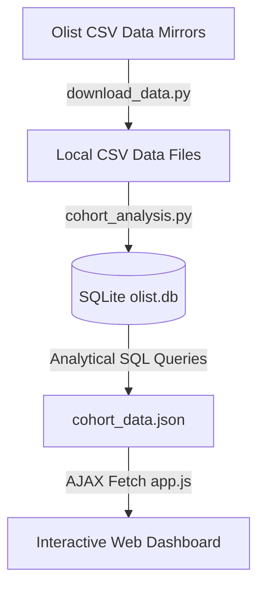

# Brazilian E-Commerce Cohort & Customer Retention Analytics Project

This repository contains an end-to-end data analysis project focusing on **Customer Cohort and Retention Metrics** utilizing the real-world Brazilian E-Commerce Dataset by **Olist** (100k orders from 2016 to 2018).

The project is structured to demonstrate advanced capabilities in **SQL (SQLite)** query design, **Python (Pandas)** data pipelines, and interactive **front-end data visualization** (HTML5, Vanilla CSS, JavaScript, and Chart.js).

---

## 💼 Business Problem
Customer Acquisition Cost (CAC) is one of the most expensive metrics for modern digital marketplaces. Understanding when customer cohorts churn, identifying high-value repeat shopping categories, and calculating Customer Lifetime Value (CLV) is critical to shifting business strategies from expensive ad-hoc marketing campaigns to sustainable, high-ROI retention models.

This analysis tracks:
* **Monthly Customer Cohort Retention (Month 0 to Month 12+)**
* **Cohort Average Order Value (AOV) and Revenue Contribution**
* **Geographical Distribution of Lifetime Purchases**
* **Product Category Drivers of Repeat Transactions**

---

## 🛠️ Project Architecture



1. **`download_data.py` (ETL Ingestion)**: Automatically pulls the primary relational tables (`orders`, `customers`, `order_items`, `order_payments`, `products`, `category_translation`) from a public repository mirror to configure the local environment.
2. **`cohort_analysis.py` (SQL Analytics Core)**: Recreates the dataset as relational tables inside a local SQLite database file (`olist.db`), sets up optimized column indexes, runs cohort matrices, and compiles business trends into a single clean JSON schema.
3. **Interactive Dashboard (`index.html`, `styles.css`, `app.js`)**: A premium dark-themed dashboard presenting dynamically colored retention matrices, trend charts, and geographic spreadsheets.

---

## 📊 Key Analytical Insights

1. **Marketplace Retention Dynamics**: The Olist marketplace experiences a steep churn curve, showing an average of **1.5% retention in Month 1**, which decays to **0.2% by Month 6**. This is a classic pattern for general marketplaces where durable goods (furniture, electronics) dominate sales, leading to single-purchase consumer behaviors.
2. **Geographical Concentration**: The state of **SP (São Paulo)** dominates the platform, accounting for **42% of customer volume and total lifetime revenue**. The remaining 58% is widely scattered across the other 26 Brazilian states, highlighting opportunities for targeted shipping subsidies or regional ad campaigns outside of SP.
3. **Category Repeat Drivers**: While "Bed, Bath, Table" and "Health & Beauty" generate the highest sales volume, "Health & Beauty" shows a significantly higher repeat purchase velocity. This suggests that consumables categories should be incentivized via automated post-purchase subscription models.

---

## 🔑 Core SQL Cohort Query

The retention matrix calculations are executed entirely inside SQLite using CTEs (Common Table Expressions) and date calculations:

```sql
-- 1. Identify Customer's First Order Month
WITH customer_cohorts AS (
    SELECT
        c.customer_unique_id,
        MIN(strftime('%Y-%m', o.order_purchase_timestamp)) AS cohort_month
    FROM olist_orders_dataset o
    JOIN olist_customers_dataset c ON o.customer_id = c.customer_id
    WHERE o.order_status NOT IN ('canceled', 'unavailable')
    GROUP BY c.customer_unique_id
),
-- 2. Build All Customer Orders with purchase Month
customer_orders AS (
    SELECT
        c.customer_unique_id,
        o.order_id,
        strftime('%Y-%m', o.order_purchase_timestamp) AS order_month
    FROM olist_orders_dataset o
    JOIN olist_customers_dataset c ON o.customer_id = c.customer_id
    WHERE o.order_status NOT IN ('canceled', 'unavailable')
),
-- 3. Calculate Cohort Indices (Months elapsed since first order)
order_cohort_indices AS (
    SELECT
        o.customer_unique_id,
        co.cohort_month,
        o.order_month,
        (cast(substr(o.order_month, 1, 4) as integer) - cast(substr(co.cohort_month, 1, 4) as integer)) * 12 +
        (cast(substr(o.order_month, 6, 2) as integer) - cast(substr(co.cohort_month, 6, 2) as integer)) AS cohort_index
    FROM customer_orders o
    JOIN customer_cohorts co ON o.customer_unique_id = co.customer_unique_id
),
-- 4. Calculate Size of Each Cohort
cohort_sizes AS (
    SELECT cohort_month, COUNT(DISTINCT customer_unique_id) as cohort_size
    FROM customer_cohorts
    GROUP BY cohort_month
)
-- 5. Combine and Aggregate Retention Percentages
SELECT
    oci.cohort_month,
    cs.cohort_size,
    oci.cohort_index,
    COUNT(DISTINCT oci.customer_unique_id) AS active_customers
FROM order_cohort_indices oci
JOIN cohort_sizes cs ON oci.cohort_month = cs.cohort_month
WHERE oci.cohort_index >= 0
GROUP BY oci.cohort_month, oci.cohort_index
ORDER BY oci.cohort_month, oci.cohort_index;
```

---

## 🚀 Running the Project Locally

### 1. Prerequisites
Ensure you have Python 3.8+ installed along with the Pandas library:
```bash
pip install pandas
```

### 2. Download the Datasets
Run the ETL download script to fetch the source CSV files:
```bash
python download_data.py
```

### 3. Execute the Analytical Engine
Run the SQL pipeline script to ingest the CSV files, configure the SQLite database, run calculations, and export the dashboard JSON schema:
```bash
python cohort_analysis.py
```

### 4. Launch the Visual Dashboard
Start a simple HTTP server to render the dashboard:
```bash
python -m http.server 8000
```
Open  browser and navigate to: **[http://localhost:8000](http://localhost:8000)**

---

